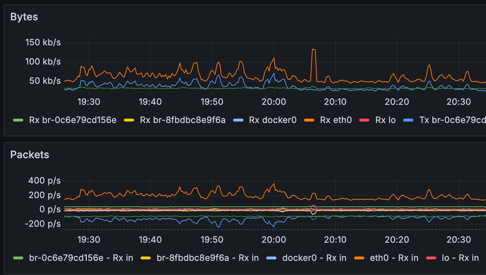

+++
date = '2025-06-28T22:10:07-04:00'
draft = false
title = 'Crash Course: Machine Learning Based Anomaly Detection in Prometheus and Grafana'
featured_image = 'images/dashboard3.jpg'
+++

I've spent the last ~1 year working in anomaly detection. Here I'll give a short crash course on how to set up your own anomaly detection using Prometheus, Grafana, and MLFlow.

<!--more-->

## So, you want to do anomaly detection?
Are you sure? Are you really really sure that you need ML anomaly detection? Here are some things to
consider before making the leap to ml based anomaly detection

* Do you have static alerting set up?
* Do you have time based alerting set up (such as moving averages)?
* Do the end users of the alerts actually understand the current alerts?
* What are you hoping to gain with ML based anomaly detection?

The last point above, I believe, is the most important. You need to clearly understand what what the current
shortfalls are of your current alerting strategy and know that ML based anomaly detection an ease some of
those pain points. With that in mind here are a few compelling reasons to pursue ml based anomaly detection:

* You have exhausted your current static and time based alerting strategy. You have configured alarm limits
for every edge case under the sun and yet you are still missing things.
* Your current alarm stragegy is comprehensive, and while accurate, is simply too much to manage. You are 
constantly tweaking limits or configurations based on the time of year, recent trends, etc. You need
something that knows the context of the system.

This is the primary selling point of ML based anomaly detection; your alarms can be context aware. For
example, you may set an alarm for cpu usage over 80% because you know that under your max load you typically 
see up to 75% usage. What if it's the middle of the night on a weekend with no users using your system/network
and your cpu usage is at 77%? An alarm won't be raised but that is certainly higher cpu usage than expected and 
may be indicitive of an underlying issue. To catch that scenario with traditional alarm limits you would need
to configure alarms based on number of users logged in in conjunction with the cpu usage. As you can probably 
tell this will be a lot of research into historical trends and a lot of hand hacking of alerts which will
quickly grow to be unmanagable. This is the most compelling reason to pursue ML based anomaly detection;
the context can be combined with the measurement to determine what is expected and what is unexpected.

## Okay, let's do it but you need to know some things first
So your problem actually warrents the complexity of using ML models, but what actually is the complexity of
productionalizing ML models here? Here are some of the productionalization problems that will need to be
considered before you start

* What is your training data going to be? Do you have enough historical data for the measurements you need 
to make a good model?
* How often do you anticipate needing to retrain this model? Does your underlying data change seasonally
shifting the baseline?
* How are you going to version your models and training data sets? If a model performs poorly in production 
how will you roll back to an old model?
* What will you use for inference? How often you actually want to run the model, how many parameters it is,
and available compute all play a part here. Luckily a lot of anomaly detection models are quite fast and 
can run well on cpu, but you need to validate this based on your anticipated scale.

## A proposed architecture
Lucky for us there are a plethora of open source tools that address many of these considerations. ML model 
development is inherently an iterative process and MLFlow does a good job helping keep track of that
chaos. Below is a general architecture:

* Grafana: This is where your data will be displayed and alerts can be set up
* Prometheus: The data collector that will be both the source of the training data and the sink for the ML
inference data
* Anomaly Exporter: A lightweight runtime that queries Prometheus for the most recent data that the model
needs, runs the model, and published the result back to Prometheus
* MLFlow: Tracking server that stores ML training runs and models. These models are retrieved by the anomaly
exporter for use.
* MinIO and Postgres: Required for MLFlow persistent storage


## Repo
[prom_anomaly_expoerter](https://github.com/wanaylor/prom_anomaly_exporter)

## Model Development
Before covering the model deployment let's look at the model development. There are a few options for anomaly 
detection but I am going to go with an isolation forest. This is a powerful tree based algorithm that is 
generally easily trainable on cpu and generally runs quickly at inference.

### Feature Selection
This effort is more around productionalizing a ML model with Prometheus and Grafana and less about building
a perfect network anomaly detection model. With this in mind I will just use the following Prometheus metrics 
that should result in a model that makes some sense but will be far from perfect. If you take a look in 
analysis.ipynb in the prom_anomaly_exporter repo you can see the metrics I pull for the model but will summarize 
in a table below. 

|Metric|br-0c6e79cd156e|br-8fbdbc8e9f6a|docker0|eth0|lo|
|-|-|-|-|-|-|
|node_network_receive_bytes_total|br-0c6e79cd156e - Rx in|br-8fbdbc8e9f6a - Rx in|docker0 - Rx in|eth0 - Rx in|lo - Rx in|
|node_network_transmit_bytes_total|br-0c6e79cd156e - Tx out|br-8fbdbc8e9f6a - Tx out|docker0 - Tx out|eth0 - Tx out|lo - Tx out|
|node_network_receive_packets_total|br-0c6e79cd156e - Pck in|br-8fbdbc8e9f6a - Pck in|docker0 - Pck in|eth0 - Pck in|lo - Pck in|
|node_network_transmit_packets_total|br-0c6e79cd156e - Pck out|br-8fbdbc8e9f6a - Pck out|docker0 - Pck out|eth0 - Pck out|lo - Pck out|

With 5 devices and 4 metrics we end up with 20 parameters that we will use for our model.

### Overfitting
I selected a training set that was just 5 days long but had metrics every 15s. Over this time period there was a 
variety of network patterns available and we want to ensure that we are training a generalized model that is not 
overfit. So how do we check for overfitting in an unsupervised model?




I decided that a good back of the napkin test would be to hold out a test set of data and compare the distribution 
of the inference results between the training and test set. The result of inference on isolation forest is [-1, 1] 
so for the training and test datasets respectively we should have some distribution of values between those limits. 
If the model is generalized well enough then we would expect the distribution of isolation forest inference results 
to be similar between the training and test sets. If the model is overfit on the training set then I would expect 
that the two distributions will differ. The underlying assumption of course is that if we K fold split our data 
set then we can make this comparison. K fold is important here due to the nature of the data. Since the data is 
time series we may have a period of time, say 1 hour, where we have high network traffic that deamatically shifts 
the underlying distribution of the testing dataset if it included that 1 hour period of time. K fold addresses some 
of those cases by shifting the test window around to capture different time windows.

### Training Loop
With those consideratios, lets take a look at the main training loop:

```python
from sklearn.ensemble import IsolationForest
from sklearn.model_selection import KFold
import numpy as np
from scipy.stats import entropy

def KL_divergence(a, b):
    hist_a = np.histogram(a, bins=200, range=(-1,1.0))[0]
    hist_b = np.histogram(b, bins=200, range=(-1,1.0))[0]
    hist_b = np.where(hist_b == 0.0, 1e-6, hist_b)
    return entropy(hist_a, hist_b)

remote_server_uri = f"http://{MLFLOW_SERVER}:5000"  # set to your server URI, e.g. http://127.0.0.1:8080
mlflow.set_tracking_uri(remote_server_uri)
mlflow.set_experiment("/Network_Bytes_and_Packets_Isolation_Forest")
mlflow.sklearn.autolog()
model_kld_scores = []
estimators = [5, 10, 50, 100, 1000, 1500, 2000, 2500, 3000, 3500, 4000, 4500, 5000]
for estimator in estimators:
    with mlflow.start_run(run_name=f'{estimator}'):
        kf = KFold()
        klds = []
        for train_index, test_index in kf.split(network_df):
            # Split the data into training and testing sets
            X_train, X_test = network_df.iloc[train_index], network_df.iloc[test_index]
            clf = IsolationForest(max_samples=estimator, random_state=0)
            clf.fit(X_train)
            # Use a KL divergence to detect overfitting
            pred_train_set = clf.decision_function(X_train)
            pred_test_set = clf.decision_function(X_test)
            kld = KL_divergence(pred_train_set, pred_test_set)
            print(f'kld is {kld}')
            klds.append(kld)
        print(f'mean of klds for {estimator} estimators is {np.mean(klds)}')
        model_kld_scores.append(np.mean(klds))
        mlflow.log_metric('average kld', np.mean(klds))
```


