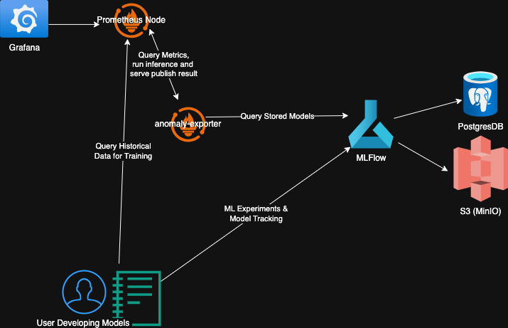
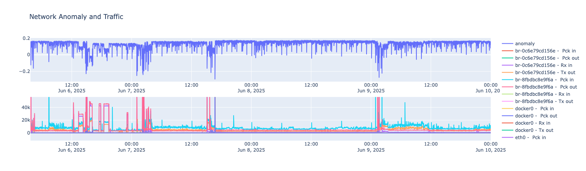

+++
date = '2025-06-28T22:10:07-04:00'
draft = false
title = 'Crash Course: Machine Learning Based Anomaly Detection in Prometheus and Grafana'
featured_image = 'images/dashboard3.jpg'
+++

I've spent the last ~1 year working in anomaly detection. Here I'll give a short crash course on how to set up your own anomaly detection using Prometheus, Grafana, and MLFlow.

<!--more-->

## So, you want to do anomaly detection?
Are you sure? Are you really really sure that you need ML anomaly detection? Here are some things to
consider before making the leap to ml based anomaly detection

* Do you have static alerting set up?
* Do you have time based alerting set up (such as moving averages)?
* Do the end users of the alerts actually understand the current alerts?
* What are you hoping to gain with ML based anomaly detection?

The last point above, I believe, is the most important. You need to clearly understand what what the current
shortfalls are of your current alerting strategy and know that ML based anomaly detection an ease some of
those pain points. With that in mind here are a few compelling reasons to pursue ml based anomaly detection:

* You have exhausted your current static and time based alerting strategy. You have configured alarm limits
for every edge case under the sun and yet you are still missing things.
* Your current alarm stragegy is comprehensive, and while accurate, is simply too much to manage. You are 
constantly tweaking limits or configurations based on the time of year, recent trends, etc. You need
something that knows the context of the system.

This is the primary selling point of ML based anomaly detection; your alarms can be context aware. For
example, you may set an alarm for cpu usage over 80% because you know that under your max load you typically 
see up to 75% usage. What if it's the middle of the night on a weekend with no users using your system/network
and your cpu usage is at 77%? An alarm won't be raised but that is certainly higher cpu usage than expected and 
may be indicitive of an underlying issue. To catch that scenario with traditional alarm limits you would need
to configure alarms based on number of users logged in in conjunction with the cpu usage. As you can probably 
tell this will be a lot of research into historical trends and a lot of hand hacking of alerts which will
quickly grow to be unmanagable. This is the most compelling reason to pursue ML based anomaly detection;
the context can be combined with the measurement to determine what is expected and what is unexpected.

## Okay, let's do it but you need to know some things first
So your problem actually warrents the complexity of using ML models, but what actually is the complexity of
productionalizing ML models here? Here are some of the productionalization problems that will need to be
considered before you start

* What is your training data going to be? Do you have enough historical data for the measurements you need 
to make a good model?
* How often do you anticipate needing to retrain this model? Does your underlying data change seasonally
shifting the baseline?
* How are you going to version your models and training data sets? If a model performs poorly in production 
how will you roll back to an old model?
* What will you use for inference? How often you actually want to run the model, how many parameters it is,
and available compute all play a part here. Luckily a lot of anomaly detection models are quite fast and 
can run well on cpu, but you need to validate this based on your anticipated scale.

## A proposed architecture
Lucky for us there are a plethora of open source tools that address many of these considerations. ML model 
development is inherently an iterative process and luckily MLFlow does a good job helping keep track of that
chaos. Below is a general architecture:

* Grafana: This is where your data will be displayed and alerts can be set up
* Prometheus: The data collector that will be both the source of the training data and the sink for the ML
inference data
* Anomaly Exporter: A lightweight runtime that queries Prometheus for the most recent data that the model
needs, runs the model, and published the result back to Prometheus
* MLFlow: Tracking server that stores ML training runs and models. These models are retrieved by the anomaly
exporter for use.
* MinIO and Postgres: Required for MLFlow persistent storage

