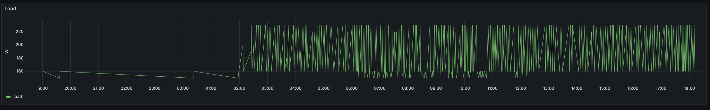
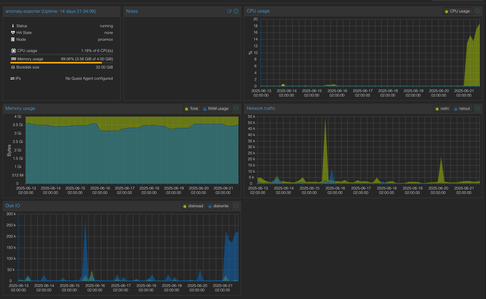
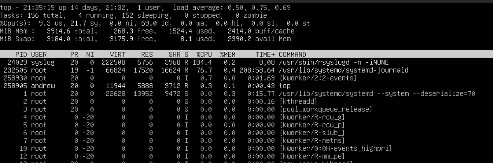
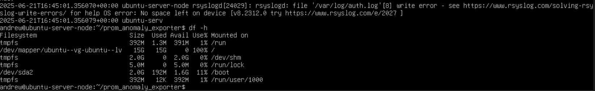
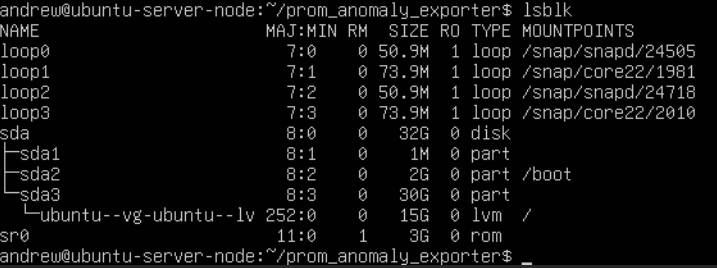
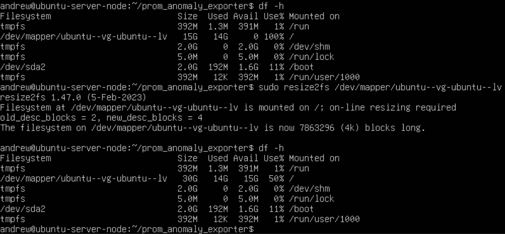

+++
date = '2025-06-25T20:38:35-04:00'
draft = false
title = 'Monitor Your Machines!'
+++

I have basic vizualization set up but admittedly not much monitoring. Checking my system one Saturday evening I found surprisingly high power draw on my UPS. Almost everything on my UPS is arm based with the exception of my Proxmox host. A quick look through my VM inventory found the culprit, my Prometheus anomaly detection VM has I/O and CPU utilization through the roof since around 2am.

<!--more-->

Investigating in the VM shows the high usage coming from rsyslogd.

`sudo less /var/log/syslog`

That'll do it...

It might help if I has actually partitioned the drives correctly

Here we need to extend the logical volume group: `sudo lvextend -l +100%FREE /dev/ubuntu-vg/ubuntu-lv`

And also extend the filesystem: `sudo resize2fs /dev/mapper/ubuntu--vg-ubuntu--lv`

